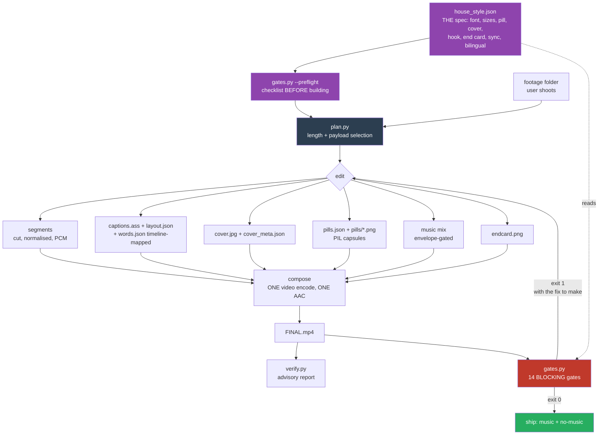
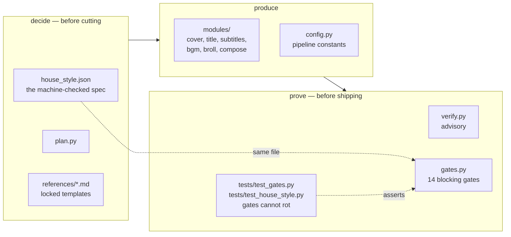
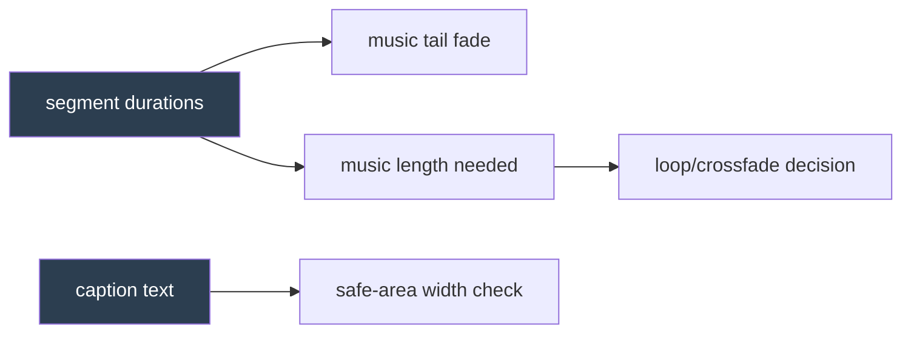
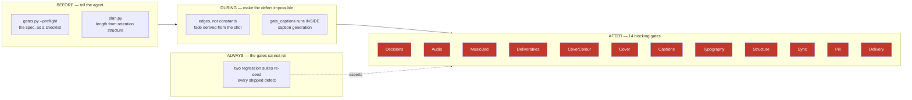

# Architecture

How this repo is put together, and *why* it is put together this way. The design
is unusual for a video tool in one respect: **most of the code exists to stop bad
output from leaving**, not to produce output faster.

## The problem it solves

Editing is a judgement loop. An agent (or a person) makes a hundred small
decisions per video — shot length, caption wording, audio level — and the failure
mode is not that any single decision is hard. It is that **decision #40 quietly
undoes decision #12**, and nobody notices until it ships.

Concretely, from the edit this repo was hardened against:

- a caption style lost its position tag and *every caption in the video* rendered
  at 50% height instead of 70%. Nobody noticed for a whole version.
- a music bed ran out 7 seconds before the video ended. The closing card played
  in silence. It shipped **twice**, because both times the level was measured,
  seen, and explained away.

Neither is a hard problem. Both are invisible without a check. So the repo's
shape follows from one claim: **quality that depends on remembering does not
survive iteration.** Encode it or lose it.

## Pipeline



Two properties of this graph matter:

1. **`gates.py` is the only edge to "ship".** There is no path from a render to a
   deliverable that skips it. It exits non-zero, so wiring it as the last step of
   any build script makes gating a consequence of producing output rather than a
   step someone remembers.
2. **Failure loops back to `edit`, not to a patch.** A gate failure is a
   statement about the cut, not about the encoder settings.
3. **The spec feeds both ends.** `house_style.json` is read by `--preflight`
   *before* the edit and by the gates *after* it. The instruction an agent is
   given and the rule it is judged against are literally the same file, so they
   cannot drift apart — and an agent that never read the docs still gets caught.

## Two entry points, deliberately

| | `postprod.py` | template-driven build |
|---|---|---|
| input | one long selfie recording | a folder of many short clips |
| cutting | automatic (silence/clap detection) | authored segment list |
| captions | ASR, word-timed, phrase-grouped | authored + verbatim, two layers |
| used by | talking-head videos | 花絮 / event / food vlogs |

`postprod.py` is a pipeline. The template workflow is a *recipe followed by an
agent*, where `references/*.md` carries the locked decisions and the agent writes
a small per-project build script. Both end at the same gates.

This split is intentional: a folder of 35 clips from an event has no automatable
"correct" cut, so the leverage is in constraining judgement, not in automating it.

## Layers



The two test files are the part people skip. They reconstruct each shipped
defect and assert the gate still catches it — without them, a threshold edited to
make one build pass silently disables the check forever. `test_house_style.py`
additionally re-seeds the defects into a *real* work directory, so the proof is
"this pipeline rejects it", not "this fixture rejects it".

## Assessed against Graph Engineering

Graph Engineering (Terry Chen / AlphaLab, 2026) frames agent work as
**Nodes（誰做）+ Edges（誰真的要等誰）+ Anchors（什麼才算真的做完）** — the design
object is the orchestration topology, not the prompt. Scored honestly:

| | state | evidence |
|---|---|---|
| **Anchors** | strong | `gates.py` is exactly an anchor: externally verifiable, machine-checked, exit-code enforced. `tests/test_gates.py` anchors the anchors — it reconstructs each shipped defect so a threshold cannot be loosened silently. |
| **Nodes** | **improved** | Node contracts are now declared as artifacts a gate can read, not conventions: `house_style.json` (the spec), `layout.json` (what each caption style claims), `cover_meta.json` (what the cover measured), `pills.json` + `pills/*.png` (that pills exist and are capsules), `words.json` (the evidence behind a verbatim claim). Each was added after a defect that was invisible precisely because the contract was implicit. |
| **Edges** | **weak — the main gap** | A build script (e.g. `references/examples/event-vlog/render.py`) is a straight sequence. Real dependencies are not modelled anywhere, so "what has to be redone when X changes" is carried in someone's head. |

**The Edges gap is not theoretical — it is the exact shape of the worst bug in
this repo's history.** The music tail fade was a constant (`TAIL_FADE = 3.0`)
chosen when the closing shot was 4.2s long. Later the closing shot was shortened
to 2.0s and the original audio under it was muted. Two nodes changed; nothing
encoded that the fade *depends on* the closing shot's duration, so the fade
silently swallowed the entire payoff card. It shipped, was "explained", and
shipped again from a different cause.

An edge would have made that a build error rather than a listening test:

```python
# instead of a constant chosen for a duration that later changed
TAIL_FADE = min(1.0, closing_segment_duration * 0.5)
```

Concretely, the edges worth declaring next:



Every one of those arrows is a bug this repo actually shipped: the fade, the
music running out, and a caption edited without re-running the width check.

**All three are now wired as edges** in the reference build: the tail fade is
derived from the closing segment, the track's audible end is measured from the
file, and `gate_captions` runs *inside* caption generation so an overflowing
`.ass` cannot be written. The gates still check all three — but they are now the
second line of defence rather than the only one. Wiring the edge also removed a
required env var (`MUSIC_AUDIBLE_END`), which was itself a footgun: forget it
when switching tracks and you silently got the previous song's value.

## Design decisions worth stealing

**A missing artifact is a failure, not a skip.**
`verify.py` warns and continues when `subtitles.ass` or a cover is absent. That
is how an entire edit shipped with no cover: every relevant check reported "not
applicable" and the report looked clean. `gates.py` fails on absence.

**Layout is declared, not inferred.**
Every caption style is declared in `layout.json` as `caption` (70% baseline),
`pill` (18%) or `free`:

```json
{"Speech": "caption", "Note": "caption", "Hook": "free"}
```

The first version of this gate matched style *names* against an allowlist and
silently passed anything named differently — 7 of 9 styles in the real project
went unchecked. Declaring `free` is allowed; it just has to be a decision someone
wrote down rather than a hole nobody saw.

**Measure the decoded artifact, never the graph that produced it.**
An `ebur128` reading inside the filter chain said −1.0 dBFS on a file that
decoded at +1.57 dBFS with 315 clipped samples. Every audio gate decodes the
finished mp4.

**Thresholds carry provenance.**
Shot-length bands are *measured* from a reviewed-and-accepted edit. Platform
length ranges are *conventions*. No retention statistics were invented to justify
a duration — where the number is a convention, the docstring says so, because a
fabricated number is indistinguishable from a real one six months later.

## The checkpoint model

A video can be wrong in six independent ways. Each one needs its own checkpoint,
because a check for one is blind to the others — the whole reason a rebuild
shipped ASS-box pills and 62pt captions is that *position* was checked and
*style* was not, and every light was green.



| dimension | the question | checkpoint | how it is measured |
|---|---|---|---|
| **Truth** | does the audio actually say this? | Sync | align caption text to `words.json`; coverage, head-offset, back-projected lag |
| **Look** | does it look like the last one? | Typography, Pill, Cover, CoverColour | style fields vs `house_style.json`; corner alpha; measured widths; the cover gold read off rendered pixels |
| **Layout** | is it where the platform UI won't eat it? | Captions, Pill | `\pos` vs declared anchor, safe-area width |
| **Structure** | are the beats there? | Structure | a Hook inside 1s; the last frame *is* the end card |
| **Sound** | can it be heard, all the way to the end? | Audio, MusicBed | decoded peak, longest dead run, last-3s level; the bed isolated by subtracting the no-music sibling |
| **Container** | will it play? | Delivery | PTS 0, A/V length match, dimensions |
| **Completeness** | did everything actually ship? | Deliverables | music + no-music pair and `cover.jpg` at the project root |
| **Consent** | were the user's calls the user's? | Decisions | `decisions.json` values, each departure carrying a written why |

**What is deliberately NOT gated**, because it is judgement and a fake check
would be worse than none: whether the hook is *interesting*, whether a payload
earns its seconds, whether a translation reads naturally, whether the cut
breathes. The harness guarantees a floor, not a ceiling. It is designed so a
reviewer spends their attention on the judgement calls instead of re-finding the
same mechanical defects.

## Gates

| gate | blocks on | shipped defect it encodes |
|---|---|---|
| Decisions | no `decisions.json`; a user choice defaulted, or departing from the default without a written why | two consecutive builds normalised loudness against the rule that says to ask, and both reported "done" |
| Audio | dead air >0.8s, ending <−32 dBFS, clipping | silent closing card (×2) |
| MusicBed | the bed dying before the video does — measured by subtracting the no-music sibling; no pair to subtract is itself a failure | a tail fade inherited from an older cut landed under the closing sentence; the last 2.5s passed gate_audio because someone was still talking |
| Deliverables | music / no-music pair or `cover.jpg` missing from the project root | half-deliveries that "both versions ship" as prose never prevented |
| CoverColour | cover subtitle not the house gold, measured off the rendered pixels | a caller passed a literal colour and nothing looked at the image |
| Cover | absent, not frame 1, title too small, subtitle width not tracking the title | whole edit with no cover; subtitle floating at an unrelated width |
| Captions | overflow, undeclared style, wrong anchor, nested colour tags | all captions at 50%; text past the safe area; `LiteRT` re-tagged inside `LiteRT-LM.js` |
| Typography | wrong font/size, outline instead of drop shadow, `\fad` where the house cut is hard, no gold keyword spans, half-translated bilingual | a rebuild at 62pt with a 6px black outline and fades on every line; a full caption pass rendered pure white (2026-08-17) |
| Structure | no Hook inside 1s, no end card, video not ending on it | hook and end card re-derived from scratch because nothing required them |
| Sync | caption text not in the audio under it, opens on a cut-off word, >1s late, or a stale `words.json` | four alignment defects found by hand-diffing a table |
| Pill | missing entirely, square corners, edge-to-edge, off 18%, faded in | pills drawn in ASS as a coarse box; the gate itself returned PASS when absent |
| Delivery | PTS≠0, audio/video length mismatch | black first frame from concat |

Thresholds live in `house_style.json` (style, structure, sync) and at the top of
`gates.py` (audio, container). Changing one is allowed; changing one to make
today's build pass is the failure this repo exists to prevent.

**Every sync threshold carries provenance.** `min_coverage 0.55` / `max_lag_s 1.0`
are not round numbers picked for feel — they were measured on a reviewed-and-
accepted edit whose worst legitimate values were 0.67 and 0.56s, then set with
margin. The margin exists because a caption may legitimately differ from the ASR:
correcting a confidently-misheard word is an *improvement* that must not read as
a defect.

## Calibrating a new check

The method that produced the Sync gate, in order — it is reusable:

1. **Find the defect by hand once.** Hand-diffing captions against spoken words
   found four real errors that every existing gate passed.
2. **Measure the metric on known-good output first.** The distribution over an
   accepted edit is what tells you where the threshold can go.
3. **Set the threshold with margin above the worst *legitimate* value**, not at
   the mean. Legitimate outliers are the ones that generate false alarms, and a
   check people learn to ignore is worse than no check.
4. **Re-seed each real defect into a real work directory** and prove it fails.
   Fixtures prove the function works; re-seeding proves the *pipeline* rejects it.
5. **Watch for the metric lying.** The first lag implementation used the matched
   block's start time and reported a −1.94s false alarm, because ASR split
   `Gemma` across a 1.8s pause. Switching to the block's *median* timestamp fixed
   it. A metric that fires on correct work will be disabled by the next person.
6. **Distinguish systematic from local error.** A whole-map time shift hides
   under a per-item threshold; it needs its own check on the median and the sign.

## Known debt

- `postprod.py`'s automatic path and the template path share `modules/` but not a
  common driver, so improvements to one do not reach the other.
- `bilingual` is off by default and only enforced when a project writes
  `house_style.local.json`. An agent that forgets the file simply is not checked —
  "does this video want English captions" is still a human decision, not an
  enforced one.
- Quality of *judgement* is unguarded by design (see the checkpoint model). The
  harness cannot tell a boring hook from a good one.
- The suite is fully green: 173 passed, no `xfail`. Five stale tests were
  cleared on 2026-08-21, and two of them were hiding real defects rather than
  merely rotting — `test_align_broll_multiword_keyword` had been marked stale
  with a copy-pasted reason and was in fact failing on a genuine bug (multi-word
  Latin keywords never matched, because the sliding window concatenates word
  texts with no separator while the keyword still carried its space). **A test
  marked `xfail` with a plausible sentence is indistinguishable from a test
  marked `xfail` because the code is broken.** If a test cannot earn its keep,
  delete it or rewrite it against the current API; do not leave it as a label.
- Root-level scripts (`plan.py`, `gates.py`, …) sit outside the `scripts/`
  convention from `skill-creator`. Left in place because the paths are already
  published in `SKILL.md`; worth moving behind a deprecation if this becomes a
  standalone repo.
