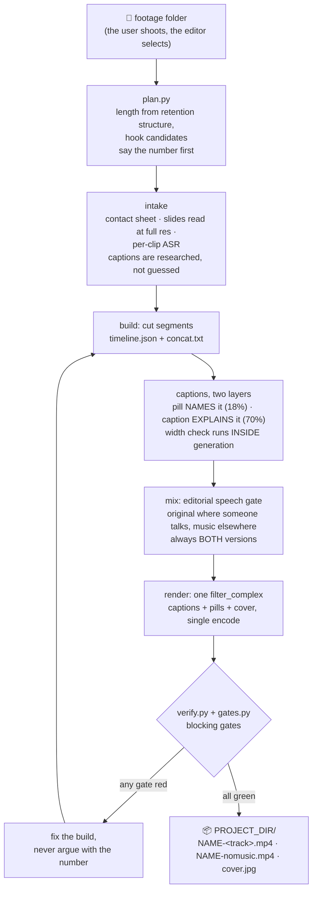

<p align="center"></p>

<p align="center">English · <a href="README.zh-TW.md">繁體中文</a></p>

# yiibu（一步）

Turn a folder of phone clips into a publish-ready 9:16 short: **one step**
(一步, *yiibu*) from footage to deliverable, with the same quality bar every
time, enforced by gates rather than by remembering.

Install: clone into `~/.claude/skills/yiibu` (any folder works — every path in
the code resolves relative to the clone), then ask your agent:
`edit video <footage folder>` (Chinese trigger phrases like 剪影片 work too).

The point of this skill is not that it can cut video. It is that the quality
bar never depends on anyone remembering. Everything below exists because
something shipped broken once and the fix was turned into a check.

## What it makes

Real outputs from both modes, the automated talking-head pipeline and the locked templates (`references/*-template.md`):

<table>
<tr>
<td align="center" width="200"><br><b>talking-head</b><br>auto B-roll + circular PiP<br>word-timed captions</td>
<td align="center" width="200"><br><b>running vlog</b><br>word-timed captions<br>gold keywords</td>
<td align="center" width="200"><br><b>community meetup</b><br>event template<br>bilingual captions</td>
</tr>
<tr>
<td align="center" width="200"><br><b>event recap, 90s</b><br>hook inside 1s, then the<br>pill names the event</td>
<td align="center" width="200"><br><b>food vlog</b><br>AUTHORED bilingual captions<br>— room noise defeats ASR</td>
<td align="center" width="200"><br><b>product demo</b><br>screen-recording B-roll<br>behind a PiP</td>
</tr>
</table>

Six situations, one house style — and the same `gates.py` blocked every one of
them until it passed. The last three are new: a 90-second event recap, a food
花絮 whose captions are *authored* because a restaurant defeats ASR, and a run
that turns into a product walkthrough with app screen-recordings as B-roll.

Three more exist and are deliberately held back — a food vlog with a bystander
child in frame, a conference recap carrying third-party official footage, and
one the author excluded. `docs/make_demos.py` lists each with its reason and
rebuilds the strip, so a hold is a recorded decision rather than a gap.

Configuration (what you can change per project, per machine, or in your fork) is documented in
[`docs/CONFIGURATION.md`](docs/CONFIGURATION.md); a full worked example, with
the gate failures that actually happened along the way, is in
[`docs/WALKTHROUGH.md`](docs/WALKTHROUGH.md).

## How a video moves through it



## Two ways to use it

**1. Talking-head mode: the automated pipeline.** You film yourself
talking; one command does the rest:

```bash
python3 postprod.py MY_TAKE.mov [--script script.json]
```

- **clap-to-delete**: clap when you fluff a line; the take before the clap is
  removed automatically, then silences are trimmed
**[See what it can put on screen →](docs/CAPABILITIES.md)** — every effect with
a picture and the phrase that triggers it.

- **word-timed captions**: ASR word timings grouped into phrases → ASS
  subtitles, animated gold keywords, face-aware placement, optional bilingual
  line, IG-style emphasis
  captions on the punchlines
- **B-roll, keyword-aligned**: matched to what you actually say, with a
  per-type fallback chain: website screenshot → stock video/photo
  (Pexels/Pixabay) → Veo generation → Gemini image → GPT image → skip cleanly
- **music bed** with speech ducking; circular-PiP or split layouts; optional
  closing CTA overlay

**2. Template mode: the agent-assembled edit.** A folder of event,
food, or running clips; the agent selects shots and builds to a locked template
(`references/*-template.md`), and the same gates block the ship. This is the
mode shown in the demo GIFs above and walked through in
[`docs/WALKTHROUGH.md`](docs/WALKTHROUGH.md).

Both modes end at the same two gates, `verify.py` and `gates.py`, and ship
both a music and a no-music version.

### What you need for full talking-head quality

Everything degrades cleanly: each missing key skips its feature, never errors.
No other skill is required; B-roll generation is built in.

| you bring | you unlock |
|---|---|
| nothing (ffmpeg + Pillow + numpy) | clap-cut, silence trim, layouts, gates |
| music you are licensed to use, dropped into `bgm-library/` ([how](bgm-library/README.md)) | music bed with ducking, the stand-in ladder |
| `faster-whisper` venv ([SETUP.md](SETUP.md)) | word-timed captions |
| Pexels / Pixabay keys (free) | stock-footage B-roll |
| Gemini API key | Veo B-roll generation, Gemini image fallback, LLM caption segmentation, bilingual line, emphasis captions |
| Playwright + Chrome | website-screenshot B-roll for product mentions |

The demo GIFs above were made with the full stack; the full table is exactly
what produced the talking-head demo.

## Using it well: how to brief the agent

The skill needs exactly one thing: **a folder of footage**. Everything else has
a sensible default, and the agent announces its plan (length, template, music)
before cutting so you can veto any part in one line. But context you provide up
front goes straight into caption quality. The agent captions what it can
verify, so telling it what the event *was* saves a research round-trip:

```
edit video ~/Downloads/0814_shanghai
event: Google GDE Summit Shanghai, one-day recap     ← what/where, for captions
platform: IG Reels, 60-90s                           ← length target
music: upbeat, chorus-first                          ← or a specific track / no music
note: don't zoom on unreleased roadmap slides;       ← boundaries only you know
      end on the group selfie
```

The last line is the highest-value one: privacy/NDA boundaries and "this shot
must be in it" are things no amount of footage analysis can discover. The full
intake contract (what the agent assumes vs what it will ask) is in
`SKILL.md`; a complete worked edit is in [`docs/WALKTHROUGH.md`](docs/WALKTHROUGH.md).

### Preparing the footage (the cheapest quality win)

Everything below is optional — the pipeline copes without it — but each line
saves a research round-trip, a re-render, or a wasted ASR pass:

- **One folder per video, un-trimmed.** Drop everything in; selection is the
  skill's job. Hand-trimming clips beforehand helps nothing and risks cutting
  off words the captions need.
- **Shoot vertical.** Rotation metadata is read per clip, so mixed
  orientations survive — but a native 9:16 shot always beats a cropped
  landscape one.
- **Flubbed a take? Clap once, then say it again.** A single clap deletes the
  3 seconds before it in the silence step; the mistake never reaches the edit.
- **Shoot the hook and the ending on purpose.** The first 2 seconds decide
  the scroll and the last beat is the payoff shot. A folder that contains one
  deliberately strange image and one deliberate closer gives the edit both.
- **Get the phone close when you speak.** Speech sitting below about −25 dB
  carries no captionable words; one sentence said near the mic beats three
  distant retakes.

## Quick start

```bash
python3 doctor.py                      # does this machine have what it needs?
python3 gates.py --preflight           # THE house style, as a build checklist
python3 plan.py  YOUR_FOOTAGE_DIR      # how long should this be, what's the payload?
#   ... cut ...
python3 verify.py WORK_DIR --output FINAL.mp4
python3 gates.py  FINAL.mp4 --work-dir WORK_DIR    # exits 1 = do not ship
```

Requirements are deliberately small: **ffmpeg, Pillow, numpy**. The caption font
is bundled. `yt-dlp` (B-roll/music) and a `faster-whisper` venv (speech captions)
are optional; both features skip cleanly when the tool is absent, they never
error. Full install (venv, API keys, fallback chains): [SETUP.md](SETUP.md).

**Platform:** the automated talking-head pipeline runs on macOS and Linux
(hardware encode on macOS, software elsewhere). Template-mode builds use
`modules/buildkit.py`, which is **macOS-only today** (videotoolbox) — see the
platform note in [SETUP.md](SETUP.md).

## Division of labour

**The user shoots. The editor selects.** You are handed a folder; deciding which
shots earn a place, in what order, and how long the result runs *is* the edit.
`plan.py` does the arithmetic for that decision: it does not shoot anything and
it does not pretend to know what is in a frame.

## How length is decided

Not "footage ÷ shot length"; that makes the video as long as the material
allows, which is backwards. Length is additive from what is worth watching:

```
length = hook(2-3s) + Σ payload(8-14s each) + connective(~25%) + ending(4-6s)
```

- **Hook**: the opening 2 seconds show the strangest thing in the folder. Not a
  sign, not walking in. If the best image is at 4:51 of a five-minute clip, that
  is frame one.
- **Payload**: one thing worth understanding, with room to land. Under three and
  there is no reason to watch; over six and none of them breathe.
- **Connective tissue**: cut this first when it feels long. Never cut payloads.

`plan.py` groups clips by the topic token in their filename, because a payload is
not the same as a long take: three 2s clips of one booth are one payload, and a
five-minute clip of a queue is none.

**On the numbers:** the shot bands are *measured* from one reviewed-and-accepted
edit. The platform ranges are *conventions*, not research; no retention
statistics were invented to justify them. Override them freely; just do not
quietly pad the output.

## The gates

`gates.py` blocks the hand-over. Each row is a defect that actually shipped:


This is what that looks like — real `gates.py` output on a real project, with
the 2026-08-17 rebuild's actual defects re-seeded into it (captions moved to
50% height, Speech dropped to 62pt with a black outline, `decisions.json`
deleted). The same video passes all fifteen gates without them:

<p align="center"></p>

Note the second failure. Deleting the user's recorded decision did not just
fail `Decisions` — it un-licensed the cold open that decision was covering, and
`MusicBed` fired too. The captured output is kept verbatim in
[`docs/gallery/gates-blocked.txt`](docs/gallery/gates-blocked.txt).

| gate | blocks on |
|---|---|
| Decisions | no `decisions.json` — a choice that is the user's (loudness, captions, end card) silently defaulted, or departing from the default without a written why |
| Audio | dead air >0.8s, silent ending (<-32 dBFS), clipping |
| MusicBed | the music bed dying before the video does (measured by subtracting the no-music sibling), or no sibling pair to measure |
| Deliverables | the music / no-music pair or `cover.jpg` missing from the project root |
| CoverColour | cover subtitle not the house gold, measured off the rendered pixels |
| Cover | no cover, frame 1 isn't the cover, title too small for a feed, subtitle width not tracking the title |
| Captions | overflow past the safe area, undeclared style, caption off its declared anchor, nested colour tags |
| Typography | wrong font or size, black outline instead of the house drop shadow, `\fad` where the house cut is hard, an all-white pass with no gold keyword spans (`Speech`-styled passes only), half-translated bilingual captions |
| Structure | no hook inside the first second, no end card, video not ending on it |
| Sync | a caption whose words are not in the audio under it: first word cut off, >1s late, wrong line over the shot, or a stale `words.json` |
| Pill | missing entirely, square corners (an ASS box, not the PIL capsule), edge-to-edge, off the 18% position, faded in |
| Duck | the bed never actually stepping out of the way of the speech under it — measured, like MusicBed, by subtracting the no-music sibling | an absolute-amplitude trigger ducked a close mic 7–9 dB, two room-distance judges 2–3 dB, and 8.5 dB under paper being turned; every other gate green, and the user found it by ear |
| Dwell | a caption on screen for less than the house floor — nobody finishes reading it | captions flashing under the minimum dwell while every position and style check passed |
| Clearance | session-looking footage with no `clearance_scan.json`, or an excluded clip still in the timeline. Silent on footage that does not look like session material | a 93.6s conference recap shipped with every other gate green and 41 of those seconds under NDA |
| Delivery | PTS≠0 black first frame, audio/video length mismatch |

The signature two-layer caption system, drawn by the code it documents
(`python3 docs/make_diagrams.py` re-renders it straight from
`house_style.json` and `modules/title.py`, so the picture cannot drift from
the spec):

<p align="center"></p>

The style, structure and sync thresholds all come from one file,
**`house_style.json`**, which `gates.py --preflight` prints as a checklist
*before* you build and the gates read *after*. The instruction and the judgement
are the same file, so they cannot drift apart, and an agent that never read the
docs is still caught.

Three design decisions worth copying if you build something similar:

1. **A missing artifact is a failure, not a skip.** An earlier runner warned and
   moved on when the cover or the subtitle file was absent — which is exactly how
   a whole edit shipped with no cover.
2. **Layout must be declared, not inferred.** Every caption style is declared in
   `WORK_DIR/layout.json` as `caption` (70% baseline), `pill` (18%) or `free`.
   The first version used a name allowlist and silently passed any style someone
   named differently — the same class of bug it existed to catch.

```json
{"Speech": "caption", "Note": "caption", "Hook": "free", "CardBig": "free"}
```

3. **Gates check position; a separate gate must check style.** A rebuild once
   shipped hand-drawn square pills and 62pt outlined captions with every gate
   green, because nothing measured typography. If a reader can recognise it, a
   gate has to be able to measure it.

`tests/test_gates.py` and `tests/test_house_style.py` reconstruct each shipped
defect and assert the gate catches it, so the gates cannot rot into always-pass.
`doctor.py` runs both.

## The rule behind all of it

> Do not reason about whether a measurement is acceptable.
> A number outside the threshold is a failure **even when you can explain it**.

A silent ending shipped twice in one session. Both times the level was measured,
seen, and talked away — "that's the song's own outro", "that's the tail fade".
Explaining a number is not checking it.

## Templates

Read the one that matches the material before touching anything else. Each is a
locked recipe, not a suggestion.

| shape | file |
|---|---|
| conference / event recap | `references/event-vlog-template.md` |
| food / restaurant vlog | `references/food-vlog-template.md` |
| running / sport talking-head | `references/running-vlog-template.md` |
| ffmpeg + delivery traps | `references/delivery-traps.md` |

## Layout

```
house_style.json   THE spec — read by --preflight and by the gates
plan.py            length + selection, before cutting
doctor.py          environment check + runs both test suites
verify.py          advisory quality report
gates.py           blocking shipping gates (15)
resolve_music.py   the music ladder — never stalls the build
build_lint.py      static lint for hand-written build scripts
modules/cover.py   cover recipe (max 2 lines, auto-sized, burned as frame 1)
modules/title.py   the rounded pill
modules/buildkit.py  proven ffmpeg primitives for template builds
tests/             gate + house-style regression suites
references/        locked templates + worked example build scripts
agents/            the four subagent definitions the workflow uses
```

## Reading map

| you want | read |
|---|---|
| install, keys, fallback chains | [SETUP.md](SETUP.md) |
| every effect it can put on screen, with its trigger | [SKILL.md capability map](SKILL.md#capability-map--everything-this-skill-can-put-on-screen) |
| the four subagents the workflow uses | [agents/](agents/) |
| cross-tool entry for non-Claude agents | [AGENTS.md](AGENTS.md) |
| how the system is designed, and why gates | [ARCHITECTURE.md](ARCHITECTURE.md) |
| every tunable knob | [docs/CONFIGURATION.md](docs/CONFIGURATION.md) |
| one edit, end to end, with the real gate failures | [docs/WALKTHROUGH.md](docs/WALKTHROUGH.md) |
| how this was built — each defect and the check it became | [docs/CHANGELOG.md](docs/CHANGELOG.md) |
| a deep dive on one hard bug (audio boundary fades) | [docs/audio-boundary-fades.md](docs/audio-boundary-fades.md) |
| the agent contract (what an LLM driving this must do) | [SKILL.md](SKILL.md) |
| contributing a gate or a feature | [CONTRIBUTING.md](CONTRIBUTING.md) |
| licences for code and media | [LICENSE](LICENSE) · [NOTICE.md](NOTICE.md) |
