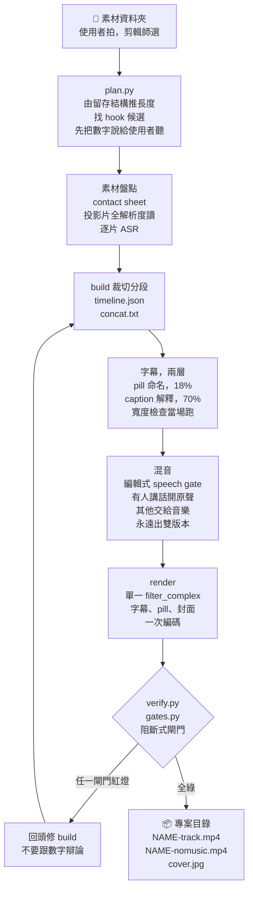
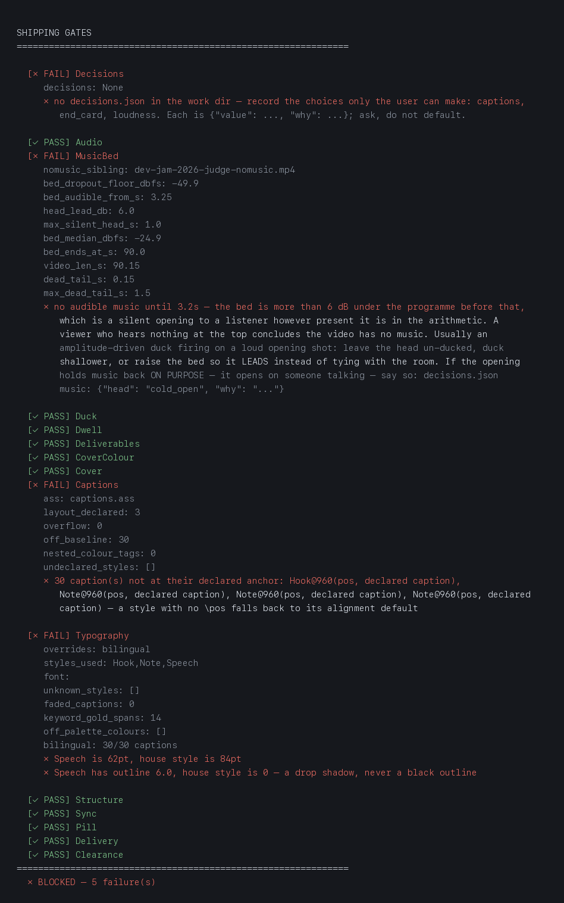
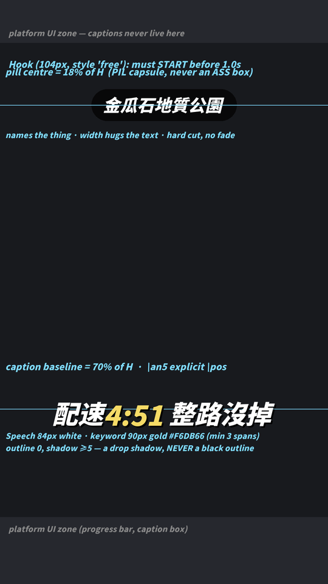

<p align="center"></p>

<p align="center"><a href="README.md">English</a> · 繁體中文</p>

# yiibu（一步）

把一資料夾手機片段，**一步**剪成能直接發布的 9:16 短影片。每一次都是同樣的品質水準，靠閘門把關，不靠人記得。

會剪影片的工具很多。這個 skill 想解決的是另一件事：品質不要靠人記得。

下面每一項設計背後都有一次真的出貨事故。出過之後我把修正寫成一道檢查，讓同一個坑不會再踩第二次。

## 安裝

**Claude Code** —— marketplace 和 plugin 各一行。skill、`/yiibu` 指令、四個
sub-agent 會一起裝好：

```
/plugin marketplace add chyiiiiiiiiiiii/yiibu
/plugin install yiibu
```

**其他 agent** —— Codex、Antigravity、Cursor、純腳本、真人都算。clone 下來就好，
你的工具會讀 repo 根目錄的 `AGENTS.md`，那份文件裡的每一條規則都是可以直接跑的指令，
不是要你記住的建議：

```bash
git clone https://github.com/chyiiiiiiiiiiii/yiibu
cd yiibu && ./install.sh
```

`install.sh` 負責 plugin 做不到的部分：ffmpeg、Pillow、numpy，然後把判定權交給
`doctor.py`。加 `--full` 會多建 faster-whisper 的 venv，逐字時間戳字幕需要它。
它沒裝的東西全部是選配，缺了會乾淨跳過。

然後在任何目錄下：

```
剪影片 ~/Downloads/my_footage        # 或：edit video <資料夾>   或：/yiibu <資料夾>
```

## 它做出來的東西

真實成品，涵蓋兩種模式：全自動口播管線與鎖定模板（`references/*-template.md`）：

<table>
<tr>
<td align="center" width="200"><br><b>口播</b><br>自動 B-roll + 圓形 PiP<br>卡拉 OK 字幕</td>
<td align="center" width="200"><br><b>夜跑</b><br>卡拉 OK 字幕<br>金色關鍵字</td>
<td align="center" width="200"><br><b>社群小聚</b><br>event 模板<br>雙語字幕</td>
</tr>
<tr>
<td align="center" width="200"><br><b>活動回顧．90 秒</b><br>1 秒內下鉤子，<br>再用膠囊標出活動名</td>
<td align="center" width="200"><br><b>美食花絮</b><br>雙語字幕全部手寫<br>餐廳太吵，ASR 派不上用場</td>
<td align="center" width="200"><br><b>產品實測</b><br>螢幕錄影當 B-roll，<br>人物在小圓框裡</td>
</tr>
</table>

六種情境，同一套 house style。每一支出貨前都被同一個 `gates.py` 擋過，改到綠燈才放行。

下排三支是這次補的。活動 recap 90 秒；美食花絮的字幕全部手寫，因為餐廳的環境音會讓
ASR 直接失效；最後一支本來是跑步影片，跑到一半變成產品實測，B-roll 用的是 App 螢幕錄影。

還有三支我沒有放上來：一支美食花絮有路人小孩入鏡，一支大會 recap 帶了第三方的官方素材，
另一支我自己決定不公開。這三支和各自的理由都寫在 `docs/make_demos.py` 裡，重建這條 demo
帶也是同一支程式在做。

能改什麼（單支影片、單台機器、或整個 fork）寫在 [`docs/CONFIGURATION.md`](skills/yiibu/docs/CONFIGURATION.md)；一次完整的實戰流程（含真實發生過的閘門失敗）在 [`docs/WALKTHROUGH.md`](skills/yiibu/docs/WALKTHROUGH.md)。

## 一支影片怎麼走完全程



## 兩種用法

**1. Talking-head／口播模式，全自動管線。** 你對著鏡頭講，一個指令做完剩下的事：

```bash
python3 postprod.py MY_TAKE.mov [--script script.json]
```

- **拍手消錯**：講壞就拍一下手，拍手前的那段自動移除，然後修剪靜音
- **卡拉 OK 字幕**：逐字時間戳 ASR → LLM 斷句的 ASS 字幕，金色關鍵字、避開臉部的定位、可選英文行、重點句自動放大成 IG 風格大字
- **B-roll 關鍵字對齊**：跟著你實際說的內容配畫面，依類型走 fallback chain：網站截圖 → 素材影片/照片（Pexels/Pixabay）→ Veo 生成 → Gemini 圖 → GPT 圖 → 乾淨跳過
- **音樂床** 自動閃避人聲；圓形 PiP 或分割版面；可選片尾 CTA 疊圖

**[看它能放到畫面上的東西 →](skills/yiibu/docs/CAPABILITIES.zh-TW.md)**　每一種效果都有圖，以及觸發它的那句話。

**2. 模板／花絮模式，agent 組裝的剪輯。** 一資料夾的活動、美食或跑步片段；agent 選鏡頭、照鎖定模板（`references/*-template.md`）組裝，同一套閘門把關出貨。上面的 demo GIF 和 [`docs/WALKTHROUGH.md`](skills/yiibu/docs/WALKTHROUGH.md) 走的就是這條。

兩種模式的終點都是 `verify.py` 與 `gates.py` 這兩道閘門，而且都同時交付音樂版和無音樂版。

### 要達到完整口播品質，你需要帶什麼

一切都優雅降級：缺哪個 key 就跳過哪個功能，絕不報錯。不需要任何其他 skill；B-roll 生成是內建的。

| 你帶 | 你解鎖 |
|---|---|
| 什麼都不用（ffmpeg + Pillow + numpy） | 拍手剪輯、靜音修剪、版面、閘門 |
| 你有授權的音樂，丟進 `bgm-library/`（[怎麼做](skills/yiibu/bgm-library/README.md)） | 音樂床＋閃避、stand-in 階梯 |
| `faster-whisper` venv（見 [SETUP.zh-TW.md](skills/yiibu/SETUP.zh-TW.md)） | 逐字時間戳的卡拉 OK 字幕 |
| Pexels / Pixabay key（免費） | 素材庫 B-roll |
| Gemini API key | Veo B-roll 生成、Gemini 圖片備援、LLM 字幕斷句、英文行、重點大字 |
| Playwright + Chrome | 提到產品時的網站截圖 B-roll |

上面的 demo GIF 全部是滿配產出的；把這張表拉滿，正是口播 demo 的實際配置。

## 怎麼用得好：如何給 agent 交代

這個 skill 只需要一樣東西：**素材資料夾**。其他全部有合理預設，而且 agent 會在動剪之前把計畫（長度、模板、音樂）一次宣告完，你一句話就能否決任何一項。但你先給的 context 會直接變成字幕品質。agent 只寫查證得了的字幕，先告訴它這是什麼活動，可以省掉一輪查證：

```
剪影片 ~/Downloads/0814_shanghai
活動：Google GDE Summit 上海，一日活動花絮        ← 是什麼、在哪裡，供字幕使用
平台：IG Reels，60-90 秒                          ← 長度目標
音樂：輕快，副歌開場                               ← 或指定曲目／不要音樂
注意：未發布的 roadmap 投影片不要放大；結尾放合照   ← 只有你知道的邊界
```

最後一行的價值最高：隱私／保密邊界和「這顆鏡頭一定要進片」是再多素材分析也挖不出來的。完整的 intake 約定（agent 假設什麼、什麼才會開口問）在 `SKILL.md`；完整實戰在 [`docs/WALKTHROUGH.md`](skills/yiibu/docs/WALKTHROUGH.md)。

### 拍攝前的準備（最便宜的品質提升）

以下每一條都是選配，沒做管線一樣跑得動。但每一條都能省下一次查證來回、一次重算，或一次白跑的 ASR：

- **一支影片一個資料夾，不要先剪。** 全部丟進來，選片是這個 skill 的工作。事先手動修剪幫不上忙，還可能剪掉字幕需要的字。
- **直式拍。** 旋轉 metadata 是逐片讀的，所以混著拍也活得下來，不過原生 9:16 還是比裁切過的橫式好。
- **講錯了？拍一下手，然後重講。** 一次拍手會在靜音步驟刪掉它前面 3 秒，那個錯誤根本不會進到剪輯裡。
- **刻意去拍 hook 和結尾。** 前 2 秒決定觀眾要不要滑走，最後一拍是回報鏡頭。資料夾裡有一個刻意奇怪的畫面和一個刻意的收尾，剪輯就兩樣都拿得到。
- **講話的時候手機靠近一點。** 大約 −25 dB 以下的語音帶不出可用的字幕；靠近麥克風講一句，勝過遠遠重錄三次。

## 快速開始

```bash
python3 doctor.py                      # 這台機器東西齊了嗎？
python3 gates.py --preflight           # house style 本尊，印成開工清單
python3 plan.py  YOUR_FOOTAGE_DIR      # 該剪多長、payload 在哪？
#   ... 剪 ...
python3 verify.py WORK_DIR --output FINAL.mp4
python3 gates.py  FINAL.mp4 --work-dir WORK_DIR    # exit 1 = 不准出貨
```

依賴刻意壓到最小：**ffmpeg、Pillow、numpy**。字幕字體隨附。`yt-dlp`（B-roll／音樂）和 `faster-whisper` venv（語音字幕）是選配，工具不在時功能乾淨跳過，永不報錯。完整安裝（venv、API key、fallback chain）：[SETUP.zh-TW.md](skills/yiibu/SETUP.zh-TW.md)。

**平台**：全自動口播管線 macOS 和 Linux 都能跑（macOS 硬體編碼，其他平台軟體編碼）。模板模式的 `modules/buildkit.py` 目前**只支援 macOS**（videotoolbox），詳見 [SETUP.zh-TW.md](skills/yiibu/SETUP.zh-TW.md) 的平台說明。

## 分工

**使用者拍，剪輯師選。** 拿到一個資料夾之後，決定哪些鏡頭配得上位置、什麼順序、成品多長，*這就是剪輯*。`plan.py` 只做這個決策的算術：它不拍片，也不假裝知道畫面裡有什麼。

## 長度怎麼決定

不是「素材 ÷ 鏡頭長度」，那會讓影片跟素材一樣長，方向就反了。長度是從值得看的東西加出來的：

```
length = hook(2-3s) + Σ payload(各 8-14s) + 過場(~25%) + 結尾(4-6s)
```

- **Hook**：開頭 2 秒放整資料夾最怪的畫面。不是招牌、不是走進場。如果最好的畫面在一支五分鐘片子的 4:51，那它就是第一幀。
- **Payload**：一件值得理解的事，加上讓它落地的空間。少於三個就沒理由看下去；多於六個就沒有一個喘得過氣。
- **過場**：覺得太長先砍這裡。永遠不砍 payload。

`plan.py` 用檔名裡的主題字分組，因為 payload 不等於長鏡頭：同一個攤位的三支 2 秒片段是一個 payload，排隊的五分鐘長片一個都不是。

**關於這些數字**：鏡頭長度區間是從一次審核通過的成品*量測*出來的；平台區間是*慣例*不是研究，沒有為了自圓其說發明留存數據。要覆蓋就覆蓋，但不要偷偷把片拉長。

## 閘門

`gates.py` 會擋下交付。每一列都是真的出過貨的缺陷：


被擋下來長這樣。這是真的輸出：拿一支已經出貨、十六道閘門全綠的專案，把 2026-08-17
那次重建的缺陷原樣種回去（字幕從 70% 移到 50%、Speech 從 84pt 掉到 62pt 並改成黑色
描邊、`decisions.json` 刪掉），再跑一次。

<p align="center"></p>

第二道紅燈才是值得看的地方。`decisions.json` 裡原本記著這支是 cold open 開場，音樂
晚進是講好的。檔案一刪，那個授權也跟著消失，`MusicBed` 就跟著開火。原始輸出逐字保存在
[`docs/gallery/gates-blocked.txt`](skills/yiibu/docs/gallery/gates-blocked.txt)。

| 閘門 | 擋什麼 |
|---|---|
| Decisions | 沒有 `decisions.json`；屬於使用者的選擇（響度、字幕、end card）被靜默預設，或偏離預設卻沒寫下 why |
| Audio | 死寂 >0.8s、結尾靜音（<-32 dBFS）、爆音 |
| MusicBed | 音樂床比影片先死（用無音樂版相減量測），或根本沒有成對版本可以相減 |
| Deliverables | 專案根目錄缺音樂版／無音樂版成對檔案或 `cover.jpg` |
| CoverColour | 封面副標不是 house 金色，直接量測渲染後的像素 |
| Cover | 沒封面、第一幀不是封面、標題小到 feed 裡看不清、副標寬度沒跟著標題 |
| Captions | 超出安全區、未宣告的樣式、字幕偏離宣告的錨點、巢狀顏色標籤 |
| Typography | 字體或字級錯、黑色描邊而非 house 陰影、house 硬切卻出現 `\fad`、整片全白沒有金色關鍵字（僅檢查用 `Speech` 樣式的字幕）、翻一半的雙語字幕 |
| Structure | 第一秒內沒有 hook、沒有 end card、影片沒有結束在 end card 上 |
| Sync | 字幕的字不在它底下的音軌裡：首字被切、晚超過 1 秒、錯行壓錯鏡頭、`words.json` 過期 |
| Pill | 整個缺失、方角（ASS 方框而非 PIL 膠囊）、貼滿邊、偏離 18% 位置、有淡入 |
| Duck | 音樂床從來沒有真的替底下的語音讓路。量法同 MusicBed：減掉無音樂版，剩下的就是音樂本身 |
| Dwell | 字幕停留時間低於 house 下限，讀者根本看不完 |
| Clearance | 看起來像議程素材的片段卻沒有 `clearance_scan.json`，或被排除的片段仍留在 timeline 裡。對不像議程素材的片段完全靜默 |
| AudioPolicy | 有段落的音軌沒有人做過決定、留或靜音卻沒寫下 why，或是寫了 policy 卻沒照著算圖——靜音段與保留段的落差直接在無音樂版上量測 |
| Delivery | PTS≠0 的黑首幀、音視訊長度不符 |

招牌的雙層字幕系統，由它所描述的程式碼直接畫出來（`python3 docs/make_diagrams.py` 從 `house_style.json` 和 `modules/title.py` 重新渲染，圖永遠不會跟規格漂移）：

<p align="center"></p>

樣式、結構與同步的門檻全部來自同一個檔案 **`house_style.json`**：開工前 `gates.py --preflight` 把它印成清單，出貨時閘門讀同一份。指令和裁決是同一個檔案，永遠不會漂移，連沒讀過文件的 agent 也逃不掉。

三個值得抄走的設計決定：

1. **缺 artifact 是失敗，不是跳過。** 早期版本在封面或字幕檔缺席時只警告不擋，一整支沒有封面的影片就是這樣出貨的。
2. **版面必須宣告，不能用猜的。** 每個字幕樣式都要在 `WORK_DIR/layout.json` 宣告為 `caption`（70% 基線）、`pill`（18%）或 `free`。第一版用名稱白名單，改個名字就靜默放行，正是它該抓的那類 bug。

```json
{"Speech": "caption", "Note": "caption", "Hook": "free", "CardBig": "free"}
```

3. **閘門查位置，就要有另一道閘門查樣式。** 一次重建曾經在每道閘門全綠的情況下，出貨了手繪方框 pill 和 62pt 描邊字幕，因為沒有東西在量 typography。讀者認得出來的東西，就必須有閘門量得出來。

`tests/test_gates.py` 和 `tests/test_house_style.py` 把每個出過貨的缺陷重建成測試、驗證閘門真的會擋，所以閘門不會爛成永遠通過。`doctor.py` 會把兩套都跑一遍。

## 這一切背後的一條規則

> 不要去論證一個量測值可不可以接受。
> 超出門檻的數字就是失敗，**就算你解釋得通也一樣**。

結尾靜音在同一個 session 出貨了兩次。兩次那個數值都被量到了、看到了、然後被解釋掉了：「那是歌本來的收尾」「那是尾部淡出」。解釋一個數字不等於檢查它。

## 模板

先讀符合素材形態的那份再動手。每份都是鎖定的配方，不是建議。

| 形態 | 檔案 |
|---|---|
| 會議／活動花絮 | `references/event-vlog-template.md` |
| 美食／餐廳花絮 | `references/food-vlog-template.md` |
| 跑步／運動 talking-head | `references/running-vlog-template.md` |
| ffmpeg 與交付陷阱 | `references/delivery-traps.md` |

## 檔案地圖

```
house_style.json   規格本尊，preflight 和閘門讀的都是它
plan.py            開剪前的長度與選材
doctor.py          環境檢查 + 跑兩套測試
verify.py          諮詢性質的品質報告
gates.py           阻斷式出貨閘門（16 道）
resolve_music.py   音樂階梯，永遠不會卡住 build
build_lint.py      手寫 build script 的靜態檢查
modules/cover.py   封面配方（最多兩行、自動調字級、烙在第一幀）
modules/title.py   圓角 pill
modules/buildkit.py  模板 build 用的驗證過 ffmpeg 元件
tests/             閘門 + house style 回歸測試
references/        鎖定模板 + 實戰 build script 範例
```

## 閱讀地圖

| 你想要 | 讀 |
|---|---|
| 安裝、API key、fallback chain | [SETUP.zh-TW.md](skills/yiibu/SETUP.zh-TW.md) |
| 系統怎麼設計、為什麼用閘門 | [ARCHITECTURE.md](skills/yiibu/ARCHITECTURE.md) |
| 每一個可調參數 | [docs/CONFIGURATION.md](skills/yiibu/docs/CONFIGURATION.md) |
| 一次完整剪輯實戰（含真實的閘門失敗） | [docs/WALKTHROUGH.md](skills/yiibu/docs/WALKTHROUGH.md) |
| 這套系統怎麼長出來的：每個缺陷與它變成的檢查 | [docs/CHANGELOG.md](skills/yiibu/docs/CHANGELOG.md) |
| 一個硬 bug 的深度解剖（音訊邊界淡化） | [docs/audio-boundary-fades.md](skills/yiibu/docs/audio-boundary-fades.md) |
| agent 合約（LLM 開這台機器該做什麼） | [SKILL.md](skills/yiibu/SKILL.md) |
| 貢獻閘門或功能 | [CONTRIBUTING.md](skills/yiibu/CONTRIBUTING.md) |
| 程式碼與媒體的授權 | [LICENSE](LICENSE) · [NOTICE.md](skills/yiibu/NOTICE.md) |

註：README 以外的深度文件目前為英文。
