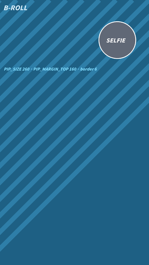
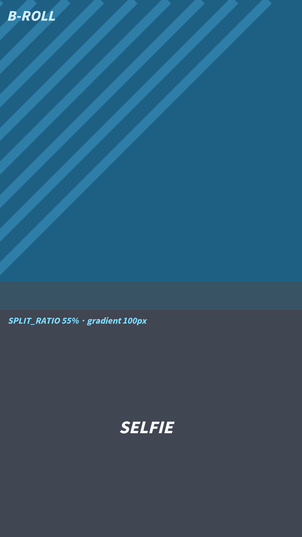
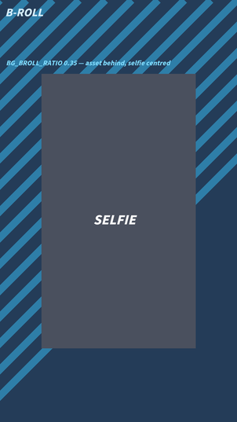
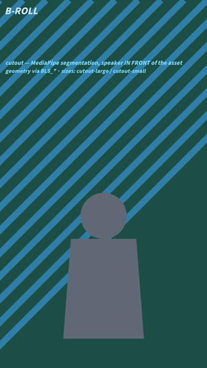

# What this can put on screen

SKILL.md carries the same list as a table, and that is the right form for an
agent: it reads SKILL.md as text and cannot see a picture. This page is for the
person, who cannot ask for `cutout-large` without knowing what one looks like.

**Copy the phrase in the last column.** That is the whole interface — you say it,
the agent wires it. Every value quoted on a tile is read from `house_style.json`
or `config.py` at render time, so a tile cannot claim geometry the code does not
use.

`render` tiles come out of the real renderer. `schematic` tiles are drawn,
because a B-roll composition is an ffmpeg graph over footage and there is no
footage in a public repo — but their proportions come from `config.py`, so the
layout is real even though the imagery is a placeholder.

Regenerate after changing either file: `python3 docs/make_gallery.py`.

---

## Captions

<table>
<tr>
<td width="300"></td>
<td>

**Two layers, and they do different jobs.** The pill NAMES the thing at 18% of
frame height; the caption EXPLAINS it on the 70% baseline. Keywords pop in house
gold at 90px inside the 76px white line, and the English line sits under it.

> 「幫我加雙語字幕，關鍵字標金色」
> `decisions.json captions:on` · bilingual via `house_style.local.json`

`render` — pill from `modules/title.py`, sizes from `house_style.json`

</td>
</tr>
<tr>
<td></td>
<td>

**Hero captions for the one line that lands.** 132px, split into stacked chunks
at staggered positions, each entering as it is spoken. Placed inside the
face-free band that face detection returns — it never lands on a face, and there
is a regression test asserting that.

> 「最重要那句用大字」
> `SUBTITLE_EMPHASIS_ENABLED` · `EMPHASIS_MAX_MOMENTS` caps how many

`render`

</td>
</tr>
</table>

## Cover

<table>
<tr>
<td width="300"></td>
<td>

**At most two title lines — the sizer trades point size for character count, so
a third line shrinks the type to nothing.** The big line says the *experience*;
product and platform names go in the subtitle, which is sized to match the
title's width so the block reads as one object in a feed. Burned as an overlay
on frame 1, never prepended as a segment (that would shift every caption).

> 「封面寫『潛入 Google 上海辦公室』」
> `modules/cover.py` `build()` · **gated**, and the gate reads `cover_meta.json`

`render` — this tile IS `cover.build()` output

</td>
</tr>
</table>

## B-roll layouts

All four are `BROLL_LAYOUT` values. `mixed` rotates between them per segment and
never repeats one more than twice in a row, which is the default because a
single layout held for ninety seconds reads as a template.

<table>
<tr>
<td width="300"></td>
<td>

**fullscreen** — the asset fills the frame, you stay in a ringed circle.
The default for talking-head videos: the B-roll carries the information, the PiP
keeps a face on screen so it still reads as a person talking.

> 「B-roll 全螢幕，我放小圓框」
> `BROLL_LAYOUT="fullscreen"` · `PIP_SIZE` `PIP_POSITION` `PIP_MARGIN_TOP`

`schematic` — circle size and margins from `config.py`

</td>
</tr>
<tr>
<td></td>
<td>

**split** — asset on top, you below, with a gradient seam between them.
Use it when the asset needs to be read (a screenshot, a spec table) and a
circular PiP would crop it.

> 「上下分割，上面放素材」
> `BROLL_LAYOUT="split"` · `SPLIT_RATIO` · `SPLIT_BLUR_HEIGHT`

`schematic`

</td>
</tr>
<tr>
<td></td>
<td>

**background** — the asset sits behind a centred selfie. The softest of the
four: the asset sets a mood rather than carrying detail, so use it for texture,
not for anything anyone has to read.

> 「素材當背景就好」
> `BROLL_LAYOUT="background"` · `BG_BROLL_RATIO`

`schematic`

</td>
</tr>
<tr>
<td></td>
<td>

**cutout** — you are segmented out of your own footage and stand IN FRONT of
the asset. The strongest of the four and the most expensive; MediaPipe does the
segmentation. Comes in `cutout-large` and `cutout-small`.

> 「把我去背站在素材前面」
> `mixed` layout · `cutout.render_cutout_segment` · geometry via `BLS_*`

`schematic`

</td>
</tr>
</table>

---

## Everything else

These have no tile yet — they are motion (a push-in, a transition, a duck) or
audio, and a still frame would misrepresent them. The full list with triggers is
the capability map in [SKILL.md](../SKILL.md).

| effect | trigger |
|---|---|
| Ken Burns on stills | automatic for image B-roll · `BROLL_KENBURNS_ZOOM` |
| punch-in on video | `buildkit.punch_in` |
| entry/exit transitions | `BROLL_TRANSITION_TYPES` · fade / zoom_in / slide_left / slide_up |
| fit-with-blur | taller-than-9:16 assets kept whole, blurred sides |
| top-title banner | `--top-title` · `--top-title-mode` |
| title card | `--title` · `--card-subtitle` |
| CTA overlay | `--cta-image` |
| end card | `decisions.json end_card:on` |
| clap-mistake removal | clap once; the silence step deletes the 3s before it |
| silence trim | speech-band RMS profiling |
| music bed + duck | `--music "<what you said>"` · **gated** |
| transition SFX | `--sfx` |
| loudness | `decisions.json loudness` |
