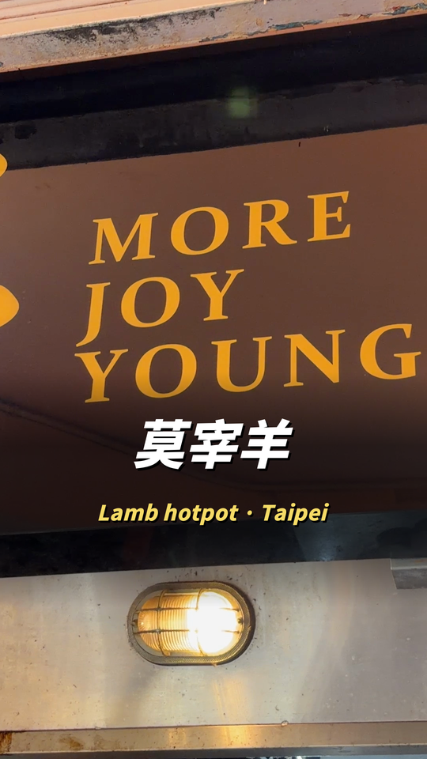

# 它能放到畫面上的東西

<a href="CAPABILITIES.md">English</a> · 繁體中文

`SKILL.md` 裡有同一份清單的表格版，那份是寫給 agent 讀的。這一頁是給人看的，因為沒有人能在沒看過長相的情況下開口要一個 `cutout-large`。

每一節最後引號裡那句話，直接抄就行。你講，agent 去接線。

圖上引用的數值都是算圖當下從 `house_style.json` 或 `config.py` 讀出來的，所以圖不可能宣稱程式沒有在用的幾何。標示方式有三種：

- `render` 是真的從渲染器出來的
- `shipped` 完全沒有經過渲染，那是某個真實專案實際交付的成品，除了裁切之外沒有加工

這一頁已經沒有任何一張是畫的了。改完 `house_style.json` 或 `config.py` 之後要重新產生：`render` 用 `python3 docs/make_gallery.py`，`shipped` 用 `python3 docs/make_demos.py`。

---

## 字幕

兩層，各做各的事。膠囊在畫面高度 18% 的位置命名這個東西，字幕在 70% 基線解釋它。關鍵字用 house 金色放大，英文行掛在下面。

> 「幫我加雙語字幕，關鍵字標金色」

整支影片最關鍵的那一句，用主視覺級的大字。拆成錯落堆疊的短塊，講到哪一塊哪一塊才進場。位置限制在人臉偵測回傳的無臉區帶裡，所以它不會壓到臉，而且有一個回歸測試在守這件事。

> 「最重要那句用大字」

## 封面

標題最多兩行。字級是拿字數換來的，多擠一行就會把字壓到看不見。大字講的是體驗，產品名和平台名放副標。

副標的寬度會被量到跟標題一致，讓整塊在動態牆裡讀起來是一個物件。封面是烙在第 1 幀上的疊圖，不是接在前面的一段影片；接在前面會把所有字幕的時間往後推。

> 「封面寫『潛入 Google 上海辦公室』」

四支實際出貨的封面，橫跨三種題材：

右邊那兩支值得比對一下。同一套模板，標題長度差很多，但兩支的副標都被量到跟標題同寬，讀起來還是一塊。這個寬度一旦沒有跟著標題走，`gate_cover` 就會擋下這次 build。

## 結尾卡

觀眾看到的最後一幀，而且閘門會檢查影片真的停在它上面。先講名字，再一行講是什麼、在哪裡。`gate_structure` 會拿最後一幀去比對 `endcard.png`，影片淡出過頭跑過自己的結尾卡，或根本沒走到它，都不會出貨。

> 「結尾放店名跟城市」

## 前後對照

同一個鏡頭，兩次：手機錄下來的那一幀，和最後出貨的那一幀。構圖、封面標題與副標、house 色盤，兩張圖之間的差異全部是這個 skill 做的。

## B-roll 版面

四種都是 `BROLL_LAYOUT` 的值。`mixed` 會逐段輪播，同一種不會連續出現超過兩次，這是預設值，因為同一個版面撐九十秒讀起來就像套版。

下面五張都是實際出貨影片的畫面，不是畫的。每一張是哪個版面，是拿同一段素材跑過 `compose.py` 四個 builder 的對照組認出來的 —— 目測判過一次，判錯了。

**fullscreen**　素材鋪滿畫面，你在一個帶圈的小圓框裡。口播影片的預設值：資訊由 B-roll 承擔，小圓框留一張臉在畫面上，讓它還讀得出是一個人在講話。

> 「B-roll 全螢幕，我放小圓框」

**split**　素材在上、你在下，中間一道漸層接縫。素材需要被讀（截圖、規格表）而圓形小框會裁掉內容的時候用它。

> 「上下分割，上面放素材」

**background**　素材模糊之後沉在置中自拍後面，往下淡出。四種裡最柔的一種，拿來鋪質感，不要拿來放任何人得讀的東西。

> 「素材當背景就好」

**cutout，小尺寸**　你從自己的畫面裡被去背，站在素材前面、左下角。由 MediaPipe 做人物分割。

> 「把我去背站在素材前面」

**cutout，大尺寸**　同一套分割放大到主講人尺寸，站在網站截圖前面。最強也最貴的一種，而且它要求來源畫面光線夠好 —— 遮罩一軟，放大就看得出來。

> 「去背放大，站在網站截圖前面」

那張的 B-roll 是別人的 GitHub 頁面，右欄的 contributor 頭像已經模糊掉。

各版面對應的參數名稱（`PIP_SIZE`、`SPLIT_RATIO`、`BG_BROLL_RATIO`、`BLS_*` 等）見[英文版](CAPABILITIES.md#b-roll-layouts)。

---

## 其他效果

以下這些還沒有圖。它們是動態（推進、轉場、ducking）或聲音，用一張靜態圖呈現會失真：靜態圖的 Ken Burns、影片的 punch-in、進出場轉場、比 9:16 更高的素材保留全貌加模糊側邊、頂部標題橫幅、開場字卡、CTA 疊圖、拍手刪除重來、靜音修剪、音樂床與 ducking、轉場音效、響度。

完整清單與觸發方式見[英文版的表格](CAPABILITIES.md#everything-else)，以及 [SKILL.md](../SKILL.md) 的能力對照表。
